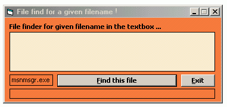



## A simple file finder

### Description

The Shortest way to find a file without API's it built with a few lines in a mudule and a few lines in a form and thats it :) i hope you will like it... If it desire vote feel free and thx for any comments or sugestions .
 
### More Info
 

             |
---                |---
**Submitted On**   |2004-03-14 12:47:34
**By**             |[kegham](https://github.com/Planet-Source-Code/PSCIndex/blob/master/ByAuthor/kegham.md)
**Level**          |Intermediate
**User Rating**    |5.0 (20 globes from 4 users)
**Compatibility**  |VB 6\.0
**Category**       |[Files/ File Controls/ Input/ Output](https://github.com/Planet-Source-Code/PSCIndex/blob/master/ByCategory/files-file-controls-input-output__1-3.md)
**World**          |[Visual Basic](https://github.com/Planet-Source-Code/PSCIndex/blob/master/ByWorld/visual-basic.md)
**Archive File**   |[A\_simple\_f1720083142004\.zip](https://github.com/Planet-Source-Code/kegham-a-simple-file-finder__1-52374/archive/master.zip)

